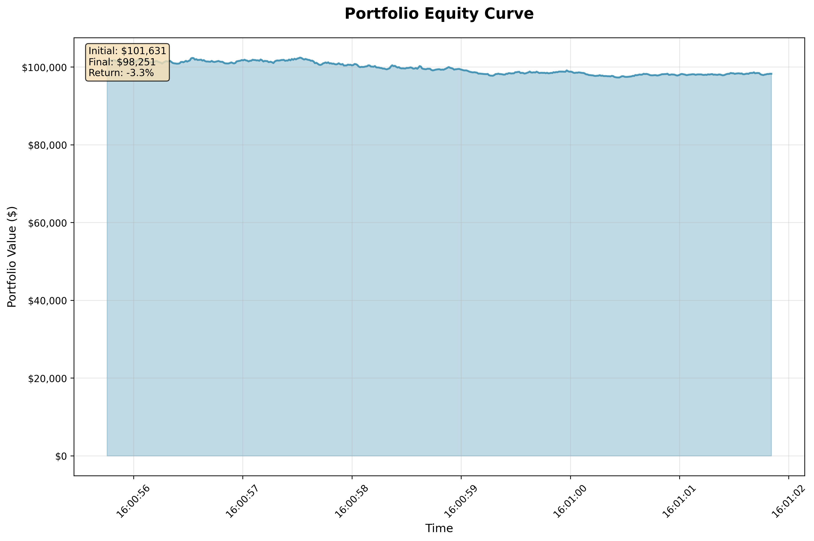

# Trading Strategy Performance Report

Generated on: 2025-09-21 23:15:17

## Executive Summary

This report analyzes the performance of the algorithmic trading strategy over the period from 2025-09-15T16:00:55.757130 to 2025-09-15T16:01:01.840650.

**Key Highlights:**
- **Total Return**: -1.75%
- **Sharpe Ratio**: -1.588
- **Maximum Drawdown**: 5.00%
- **Win Rate**: 48.0%

## Portfolio Performance

| Metric | Value |
|--------|-------|
| Initial Capital | $100,000.00 |
| Final Portfolio Value | $98,250.80 |
| Total Return | -1.75% |
| Absolute Profit/Loss | $-1,749.20 |

## Risk Metrics

| Metric | Value |
|--------|-------|
| Sharpe Ratio | -1.588 |
| Maximum Drawdown | 5.00% |
| Volatility (Daily) | 0.15% |
| Best Period Return | +0.49% |
| Worst Period Return | -0.47% |

## Trading Statistics

| Metric | Value |
|--------|-------|
| Total Signals Generated | 169 |
| Total Orders Placed | 169 |
| Successful Orders | 146 |
| Failed Orders | 23 |
| Order Success Rate | 86.4% |
| Total Trading Periods | 499 |
| Winning Periods | 238 |
| Losing Periods | 258 |
| Win Rate | 48.0% |
| Average Period Return | -0.007% |

## Strategy Analysis

| Strategy | Signals | Orders | Success Rate | Failed Orders |
|----------|---------|--------|--------------|---------------|
| MOMENTUM | 129 | 129 | 88.4% | 15 |
| SMA_CROSSOVER | 40 | 40 | 80.0% | 8 |

## Drawdown Analysis

| Metric | Value |
|--------|-------|
| Maximum Drawdown | 5.00% |
| Peak Portfolio Value | $102,415.40 |
| Trough Portfolio Value | $97,295.60 |
| Drawdown Start | 2025-09-15 16:00:57.524127 |
| Drawdown End | 2025-09-15 16:01:00.439681 |
| Drawdown Duration | 0 days |

## Current Positions

| Symbol | Quantity | Average Price | Market Value |
|--------|----------|---------------|-------------|
| AAPL | 60 | $95.16 | $5,709.79 |

## Equity Curve

*Figure: Portfolio value evolution over time showing the cumulative performance of the trading strategy.*

## Performance Interpretation

### Overall Assessment
The strategy experienced a negative return of -1.75% over the testing period, with poor risk-adjusted returns as indicated by a low Sharpe ratio.

### Risk Assessment
The strategy experienced a maximum drawdown of 5.00%, which represents the largest peak-to-trough decline in portfolio value. This relatively low drawdown suggests good risk management.

### Trading Effectiveness
The strategy achieved a win rate of 48.0% with an order execution success rate of 86.4%. The win rate below 50% suggests the strategy may need refinement, though this could be acceptable if winning trades are larger than losing ones.

### Recommendations
Based on the analysis:

1. **Risk Management**: Current risk levels appear manageable.
2. **Strategy Optimization**: Focus on improving trade selection criteria to increase win rate.
3. **Performance**: The strategy requires further development before considering live implementation.

---

*This report was generated automatically by the CSV-Based Algorithmic Trading Backtester.*
*Past performance does not guarantee future results.*
