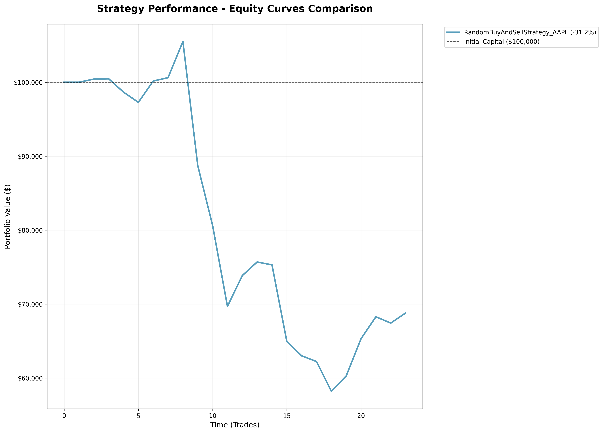

# Trading Strategy Performance Report

**Generated:** 2025-09-22 02:08:03  
**Backtest Period:** 2025-09-15T16:00:55.757130 to 2025-09-21T23:53:16.260874  
**Total Market Ticks:** 1,500

---

## Executive Summary

This report analyzes the performance of 1 algorithmic trading strategies over the backtest period.

**Key Performance Highlights:**
- **Total Portfolio Return:** -0.99%
- **Absolute Profit/Loss:** $-990.91
- **Risk-Adjusted Return (Sharpe):** -2.677
- **Maximum Drawdown:** 3.28%
- **Win Rate:** 48.1%

---

## Portfolio Performance Metrics

| Metric | Value |
|--------|--------|
| **Initial Capital** | $100,000.00 |
| **Final Portfolio Value** | $99,009.09 |
| **Total Return** | -0.99% |
| **Absolute P&L** | $-990.91 |
| **Average Daily Return** | -0.001% |

---

## Risk Analysis

| Metric | Value | Interpretation |
|--------|--------|----------------|
| **Sharpe Ratio** | -2.677 | Poor risk-adjusted performance |
| **Maximum Drawdown** | 3.28% | Low maximum loss from peak |
| **Volatility (Daily)** | 0.06% | Daily portfolio volatility |
| **Best Period Return** | +0.32% | Single best trading period |
| **Worst Period Return** | -0.31% | Single worst trading period |

---

## Strategy Performance Breakdown

| Strategy | Initial Capital | Final Value | Return | P&L |
|----------|----------------|-------------|--------|-----|
| **RandomBuyAndSellStrategy_AAPL** | $100,000.00 | $99,814.28 | -0.19% | $-185.72 |

---

## Trading Statistics

| Metric | Value |
|--------|--------|
| **Total Signals Generated** | 39 |
| **Total Orders Placed** | 39 |
| **Successful Orders** | 39 |
| **Failed Orders** | 0 |
| **Order Success Rate** | 100.0% |
| **Total Trading Periods** | 1499 |
| **Winning Periods** | 239 |
| **Losing Periods** | 258 |
| **Win Rate** | 48.1% |

---

## Periodic Returns Analysis

**Sample of Recent Returns** (Last 10 periods):

| Period | Return |
|--------|--------|
| Period 1490 | +0.000% |
| Period 1491 | +0.000% |
| Period 1492 | +0.000% |
| Period 1493 | +0.000% |
| Period 1494 | +0.000% |
| Period 1495 | +0.000% |
| Period 1496 | +0.000% |
| Period 1497 | +0.000% |
| Period 1498 | +0.000% |
| Period 1499 | +0.000% |

**Returns Summary:**
- Average Period Return: -0.001%
- Positive Periods: 239/1499 (15.9%)
- Total Periods Analyzed: 1499

---

## Equity Curve Analysis

*Figure: Portfolio value evolution over time showing the performance of each strategy.*

---

## Performance Interpretation

### Overall Assessment
The portfolio experienced a **negative return of -0.99%**, indicating losses during the backtest period. The Sharpe ratio of -2.677 suggests **poor risk-adjusted performance**. 

### Risk Profile
The strategy experienced a maximum drawdown of **3.28%**, representing the largest peak-to-trough decline. This is considered a **low-risk** drawdown level.

### Trading Effectiveness
- **Win Rate:** 48.1% of trading periods were profitable
- **Execution Quality:** 100.0% order success rate
- **Strategy Diversity:** 1 different strategies deployed

### Strategy Analysis
- **Top Performer:** RandomBuyAndSellStrategy_AAPL with -0.19% return
- **Underperformer:** RandomBuyAndSellStrategy_AAPL with -0.19% return
- **Portfolio Effect:** Diversification across strategies did not prevent overall losses

---

## Recommendations

### 1. Strategy Optimization
- **Improve Win Rate:** Current win rate is below 50%. Consider refining entry/exit criteria.

### 2. Risk Management
- **Risk Control:** Current drawdown levels are acceptable. Maintain existing risk controls.

### 3. Performance Enhancement
- **Strategy Review:** Re-evaluate strategy parameters, market conditions, and implementation before live deployment.

---

## Final Positions

| Symbol | Quantity | Avg Price | Current Value |
|--------|----------|-----------|---------------|
| AAPL | 1 | $99.27 | $99.27 |

---

## Appendix

**Data Sources:**
- Market Data: CSV file with 1,500 price ticks
- Strategies Tested: RandomBuyAndSellStrategy(AAPL)

**Risk Disclaimers:**
- Past performance does not guarantee future results
- All investments carry risk of loss
- This analysis is for educational purposes only

---

*Report generated by CSV-Based Algorithmic Trading Backtester*  
*Generation Time: 2025-09-22 02:08:03*
